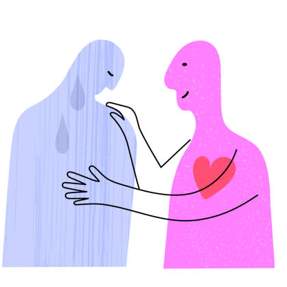
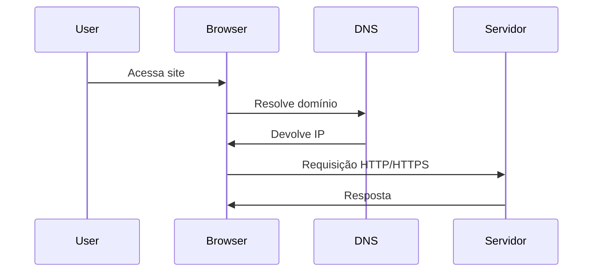
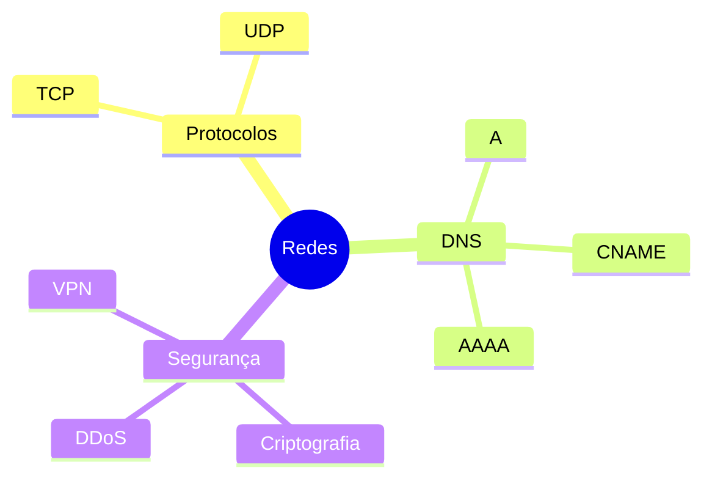
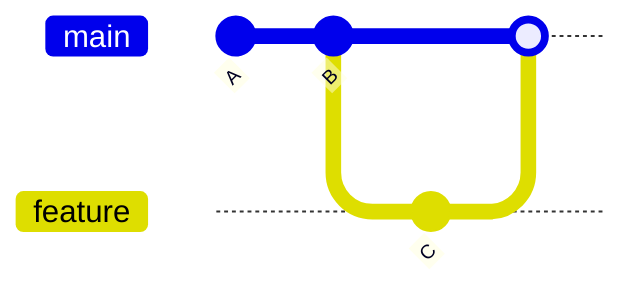
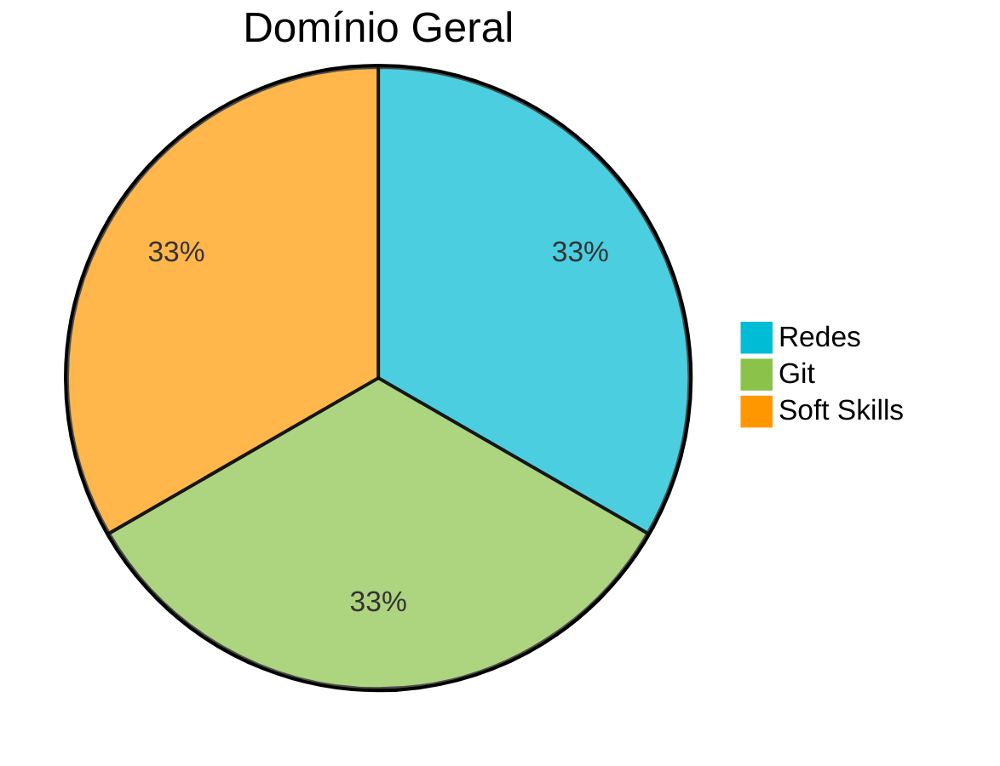

# Resumo do Curso — Hard Skills & Soft Skills (SEMANAS 1 - 3)

<table>
  <tr>
    <td>
      <a href="https://www.alphaedtech.org.br/">
        
      </a>
    </td>
    <td>
      <h2>PLATAFORMA ALPHA EDTECH</h2>
    </td>
  </tr>
</table>


---

# Professores

<table>
<tr>

<td align="center" style="padding:20px; border:1px solid #ccc; border-radius:15px; background:#f2f2f2;">
  <span style="display: block; width: 80px; height: 80px; border-radius: 50%; overflow: hidden; margin: 0 auto;">
    <br><br>
  </span>
  <b>Kenji Taniguchi</b><br>
  <a href="https://www.linkedin.com/in/kenjitaniguchi/">Linkedin</a> · 
  <a href="https://http.cat/status/500">GitHub</a>
</td>

<td align="center" style="padding:20px; border:1px solid #ccc; border-radius:15px; background:#f2f2f2;">
  <span style="display: block; width: 80px; height: 80px; border-radius: 50%; overflow: hidden; margin: 0 auto;">
    <br><br>
  </span>
  <b>Flavia Caçapava Lorenzi</b><br>
  <a href="https://http.cat/status/418">Linkedin</a> · 
  <a href="https://http.cat/status/506">GitHub</a>
</td>

<td align="center" style="padding:20px; border:1px solid #ccc; border-radius:15px; background:#f2f2f2;">
  <span style="display: block; width: 80px; height: 80px; border-radius: 50%; overflow: hidden; margin: 0 auto;">
    <br><br>
  </span>
  <b>Felipe Ozias</b><br>
  <a href="https://www.linkedin.com/in/felipe-ozias/">Linkedin</a> · 
  <a href="https://http.cat/status/501">GitHub</a>
</td>

<td align="center" style="padding:20px; border:1px solid #ccc; border-radius:15px; background:#f2f2f2;">
  <span style="display: block; width: 80px; height: 80px; border-radius: 50%; overflow: hidden; margin: 0 auto;">
    <br><br>
  </span>
  <b>Mori (mentor)</b><br>
  <a href="https://http.cat/status/510">Linkedin</a> · 
  <a href="https://http.cat/status/417">GitHub</a>
</td>

</tr>
</table>

## Navegação
- [Hard Skills](#hard-skills)
- [Soft Skills](#soft-skills)

---

## Hard Skills

<details>
<summary> Módulo 1 — Redes de Computadores</summary>

### Tipos de Redes

| Tipo | Alcance | Exemplos |
|------|---------|----------|
| LAN | Local | Casa, empresa |
| WAN | Amplo | Internet |
| MAN | Cidade | Provedores |
| PAN | Pessoal | Bluetooth |

---

### Topologias de Rede

```
(ASCII)
        [Switch]
     /     |     \
  PC1    PC2    PC3
```

Backbones → **malha (mesh)** por redundância.

---

### Protocolo da Web
- HTTP = texto puro  
- HTTPS = HTTP + TLS (criptografia + integridade)

---

### AJAX

```js
fetch("/api/data")
  .then(r => r.json())
  .then(console.log);
```

---

### Machine Learning na Web
- Recomendações
- Agrupamentos
- Análise comportamental

---

### Smart Contracts
- Executam regras automaticamente na blockchain  
- Sem intermediários

---

### Fluxo da Web (Mermaid)



</details>

<details>
<summary> Módulo 2 — Protocolos, IP, DNS e Arquitetura</summary>

### TCP x UDP

| Protocolo | Confiável | Rápido | Uso |
|-----------|-----------|--------|-----|
| TCP | ✔️ | ❌ | Web, email |
| UDP | ❌ | ✔️ | Jogos, VoIP |

---

### NAT

```
192.168.1.10 --> 200.100.1.1:50001
192.168.1.11 --> 200.100.1.1:50002
```

---

### IPv4 x IPv6
- IPv4: limitado  
- IPv6: enorme + seguro  

---

### DNS — Registros
- A / AAAA  
- CNAME  
- TXT  
- PTR  

---

### Segurança e Arquitetura
- VPN  
- DDoS  
- QoS  
- Multicast  

---

### Mapa mental (Mermaid)



</details>

<details>
<summary> Módulo 3 — Git e Versionamento</summary>

### Conceitos do Git

| Conceito | Definição |
|----------|-----------|
| Working Tree | Arquivos reais |
| Index | Staging |
| Commit | Snapshot |
| HEAD | Posição atual |

---

### Fluxo Básico

```bash
git init
git add .
git commit -m "Inicial"
git branch feature-x
git checkout feature-x
```

---

### Merge (com conflito)

```
<<<<<<< HEAD
Versão A
=======
Versão B
>>>>>>> feature
```

---

### Repositórios Remotos

- `main` = local  
- `origin/main` = GitHub  

Quando diferentes → divergência.

---

### Histórico Git (Mermaid)



</details>

---

## Soft Skills

<details>
<summary> Comunicação e Escuta Ativa</summary>

### Linguagem Corporal
- Postura  
- Olhar  
- Gestos  

---

### Escuta Ativa

> "Ouvir é biológico. Escutar é intencional."

Checklist:
- [x] Não interromper  
- [x] Confirmar entendimento  
- [x] Observar sinais  
- [x] Fazer perguntas  

---

### Feedback  
Modelo:  
**Situação → Comportamento → Impacto**

> "Na reunião, quando você interrompeu, eu perdi o raciocínio."

</details>

---

## Estatísticas Gerais

<div style="zoom:75%">



</div>
