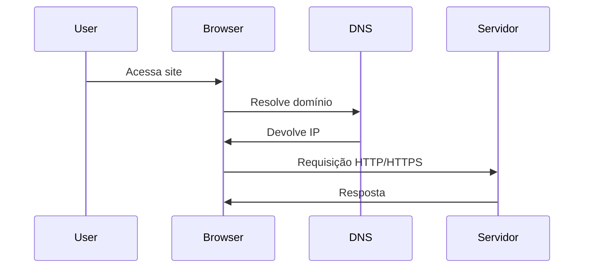
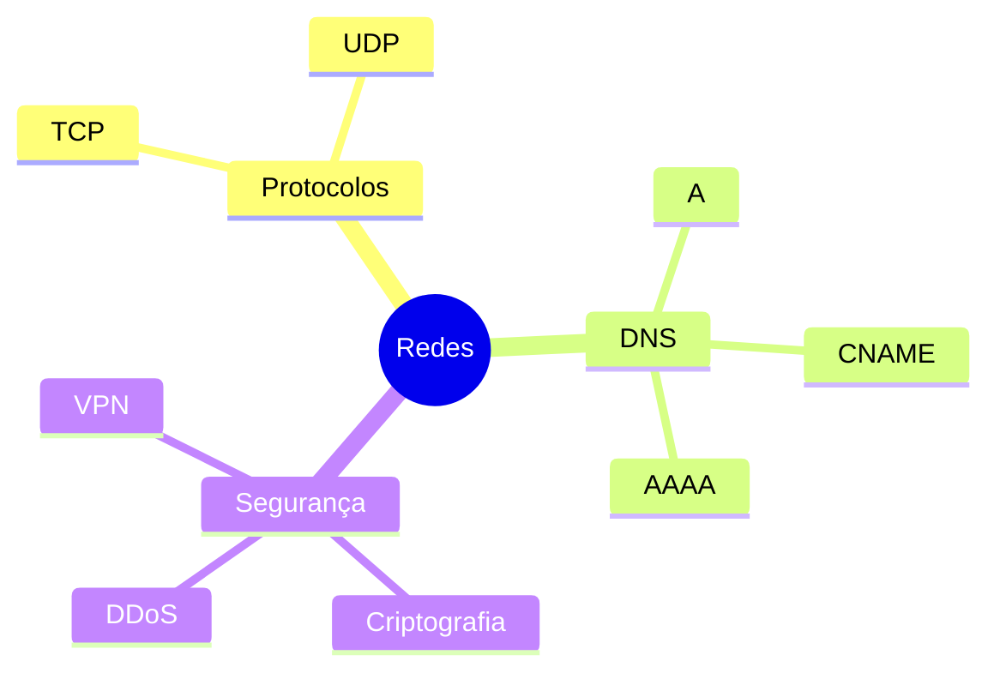
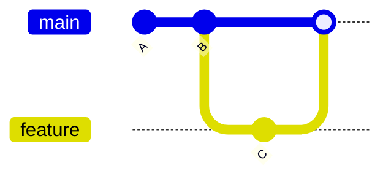
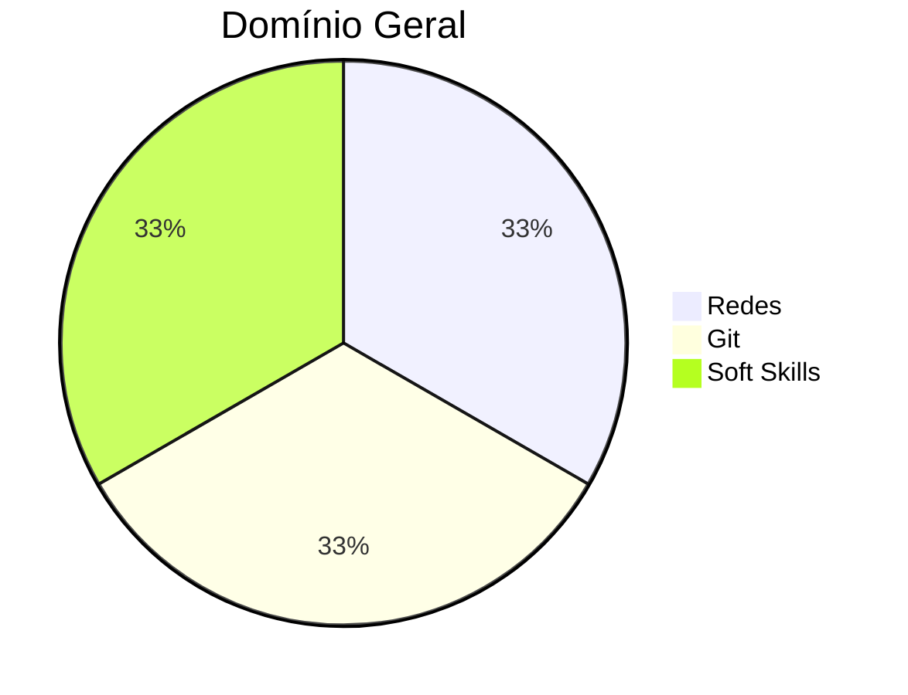

# Resumo do Curso — Hard Skills & Soft Skills (SEMANAS 1 - 3)

## Plataforma Alpha EdTech
[](https://www.alphaedtech.org.br/)


---

# 👨‍🏫 Professores

### 🟦 Kenji Taniguchi
{width=120}

**Redes sociais:**
- {width=15} [LinkedIn](https://www.linkedin.com/in/kenjitaniguchi/)
- {width=15} [GitHub](https://github.com/)

---

### 🟩 Professor 2
{width=120}

**Redes sociais:**
- [LinkedIn](https://linkedin.com)
- [Instagram](https://instagram.com)

---

### 🟧 Professor 3
{width=120}

**Redes sociais:**
- [LinkedIn](https://linkedin.com)
- [Instagram](https://instagram.com)

---

# 📌 Navegação
- [Hard Skills](#hard-skills)
- [Soft Skills](#soft-skills)

---

# Hard Skills

<details>
<summary><strong>Módulo 1 — Redes de Computadores</strong></summary>

### Tipos de Redes

| Tipo | Alcance | Exemplos |
|------|---------|----------|
| LAN | Local | Casa, empresa |
| WAN | Amplo | Internet |
| MAN | Cidade | Provedores |
| PAN | Pessoal | Bluetooth |

---

### Topologias de Rede

```
        [Switch]
     /     |     \
  PC1    PC2    PC3
```

---

### Protocolo da Web
- HTTP = texto puro  
- HTTPS = HTTP + TLS

---

### AJAX

```js
fetch("/api/data")
  .then(r => r.json())
  .then(console.log);
```

---

### Machine Learning na Web
- Recomendações  
- Agrupamentos  
- Análise comportamental  

---

### Smart Contracts
- Executam regras automaticamente na blockchain  
- Sem intermediários

---

### Fluxo da Web (Mermaid)



</details>

---

<details>
<summary><strong>Módulo 2 — Protocolos, IP, DNS e Arquitetura</strong></summary>

### TCP x UDP

| Protocolo | Confiável | Rápido | Uso |
|-----------|-----------|--------|-----|
| TCP | ✔️ | ❌ | Web, email |
| UDP | ❌ | ✔️ | Jogos, VoIP |

---

### NAT (Exemplo)

```
192.168.1.10 --> 200.100.1.1:50001
192.168.1.11 --> 200.100.1.1:50002
```

---

### IPv4 x IPv6
- IPv4: limitado  
- IPv6: enorme + seguro  

---

### DNS — Registros
- A / AAAA  
- CNAME  
- TXT  
- PTR  

---

### Segurança e Arquitetura
- VPN  
- DDoS  
- QoS  
- Multicast  

---

### Mapa mental (Mermaid)



</details>

---

<details>
<summary><strong>Módulo 3 — Git e Versionamento</strong></summary>

### Conceitos do Git

| Conceito | Definição |
|----------|-----------|
| Working Tree | Arquivos reais |
| Index | Staging |
| Commit | Snapshot |
| HEAD | Posição atual |

---

### Fluxo Básico

```bash
git init
git add .
git commit -m "Inicial"
git branch feature-x
git checkout feature-x
```

---

### Merge (com conflito)

```
<<<<<<< HEAD
Versão A
=======
Versão B
>>>>>>> feature
```

---

### Repositórios Remotos

- `main` = local  
- `origin/main` = GitHub  

---

### Histórico Git (Mermaid)



</details>

---

# Soft Skills

<details>
<summary><strong>Comunicação e Escuta Ativa</strong></summary>

### Linguagem Corporal
- Postura  
- Olhar  
- Gestos  

---

### Escuta Ativa

> "Ouvir é biológico. Escutar é intencional."

Checklist:
- [x] Não interromper  
- [x] Confirmar entendimento  
- [x] Observar sinais  
- [x] Fazer perguntas  

---

### Feedback
Modelo:  
**Situação → Comportamento → Impacto**

</details>

---

# 📊 Estatísticas Gerais


