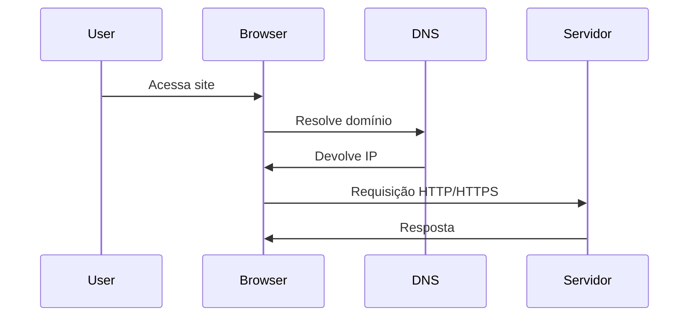
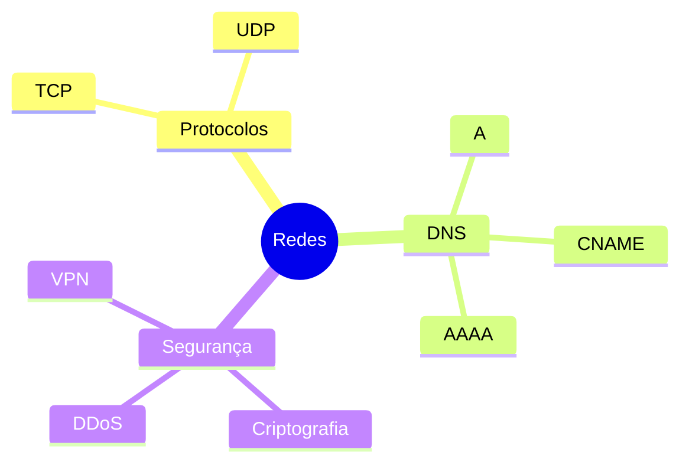
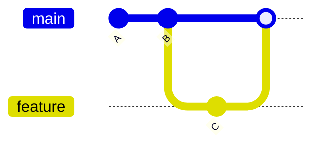
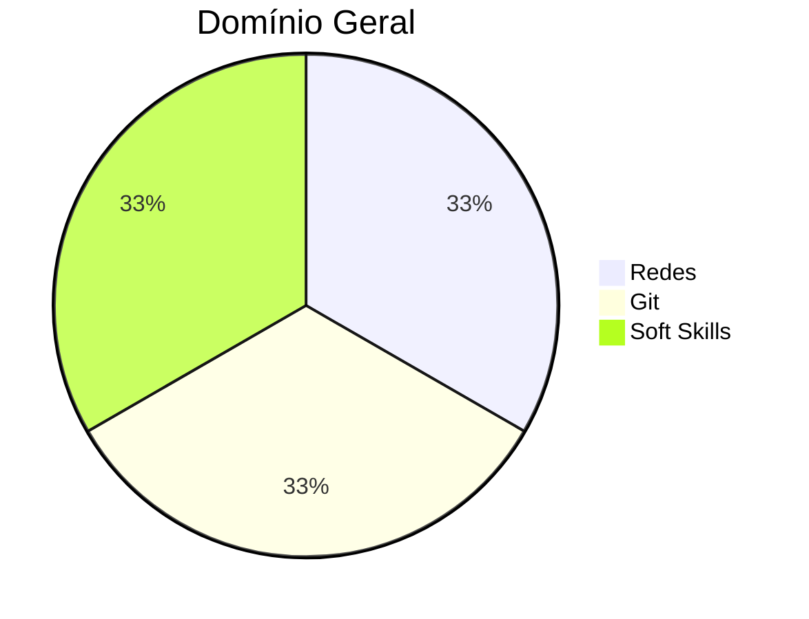

# 📘 Resumo do Curso — Hard & Soft Skills


---

# Professores

| {width=120} | {width=120} | {width=120} |
|---|---|---|
| **Kenji Taniguchi**  <br> [LinkedIn](https://www.linkedin.com/in/kenjitaniguchi/) · [GitHub](https://github.com/) | **Professor 2**  <br> [LinkedIn](https://linkedin.com) · [Instagram](https://instagram.com) | **Professor 3**  <br> [LinkedIn](https://linkedin.com) · [Instagram](https://instagram.com) |

---

# Navegação
- [Hard Skills](#hard-skills)
- [Soft Skills](#soft-skills)
- [Estatísticas](#estatísticas-gerais)

---

# Hard Skills

## 1) Redes de Computadores
<details>
<summary><strong>Clique para abrir</strong></summary>

### Tipos de Redes
| Tipo | Alcance | Exemplos |
|------|---------|----------|
| LAN | Local | Casa, empresa |
| WAN | Amplo | Internet |
| MAN | Cidade | Provedores |
| PAN | Pessoal | Bluetooth |

### Topologias
```
        [Switch]
     /     |     \
  PC1    PC2    PC3
```

### Protocolo HTTP/HTTPS
- **HTTP** → texto puro  
- **HTTPS** → HTTP + TLS (criptografia + integridade)

### Fluxo da Web (Mermaid)


</details>

---

## 2) Protocolos, IP, DNS e Arquitetura
<details>
<summary><strong>Clique para abrir</strong></summary>

### TCP x UDP
| Protocolo | Confiável | Rápido | Uso |
|-----------|-----------|--------|-----|
| TCP | ✔️ | ❌ | Web, email |
| UDP | ❌ | ✔️ | Jogos, VoIP |

### DNS – Registros
- A  
- AAAA  
- CNAME  
- TXT  
- PTR  

### Mindmap (Mermaid)


</details>

---

## 3) Git e Versionamento
<details>
<summary><strong>Clique para abrir</strong></summary>

### Conceitos Básicos
| Conceito | Definição |
|----------|-----------|
| Working Tree | Arquivos reais |
| Index | Staging |
| Commit | Snapshot |
| HEAD | Posição atual |

### Fluxo
```bash
git init
git add .
git commit -m "Inicial"
git branch feature-x
git checkout feature-x
```

### Histórico (Mermaid)


</details>

---

# Soft Skills
<details>
<summary><strong>Clique para abrir</strong></summary>

### Linguagem Corporal
- Postura  
- Olhar  
- Gestos  

### Escuta Ativa
> “Ouvir é biológico. Escutar é intencional.”

Checklist:
- [x] Não interromper  
- [x] Confirmar entendimento  
- [x] Observar sinais  
- [x] Fazer perguntas  

### Feedback
Modelo SCI:  
**Situação → Comportamento → Impacto**

</details>

---

# Estatísticas Gerais



---
